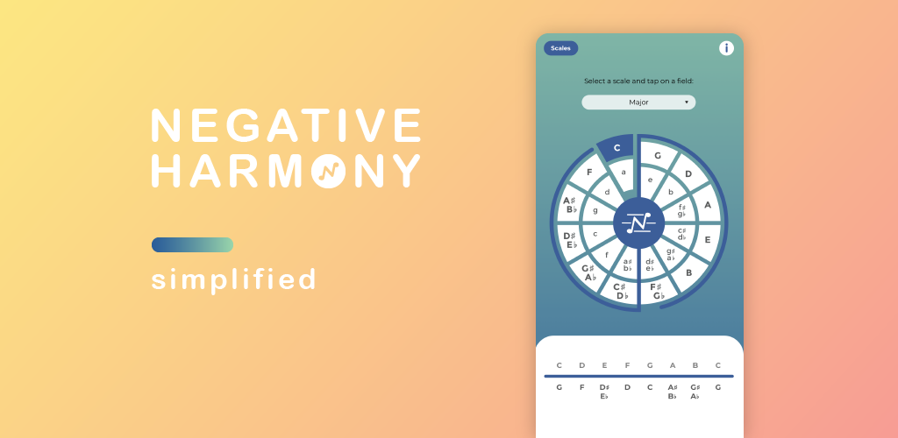
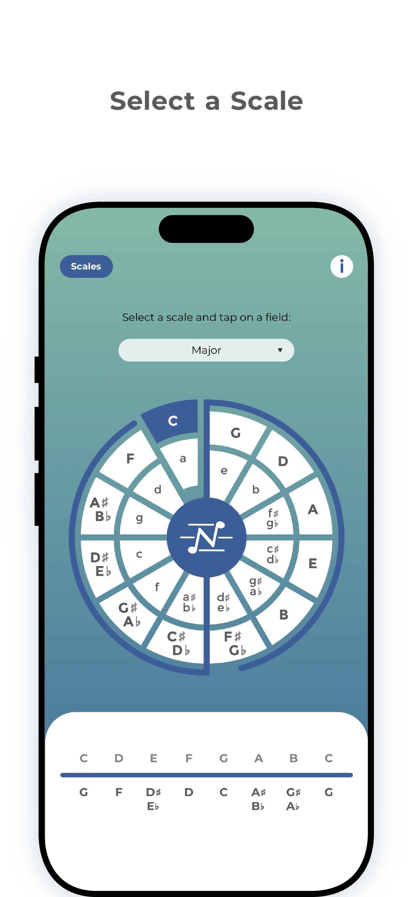
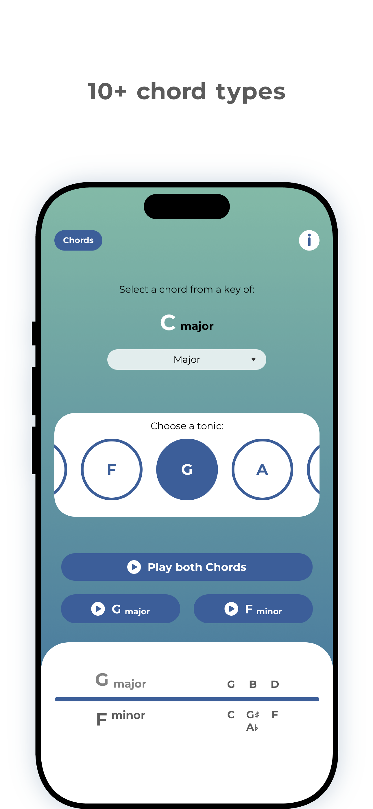
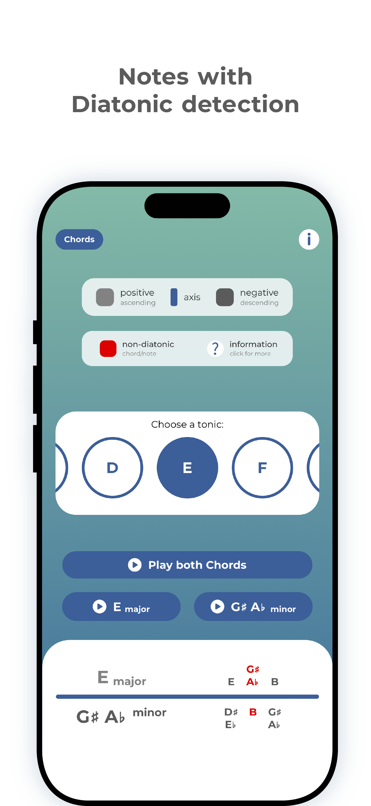

# Negative Harmony - Simplified

### Find scales, modes & chords

###### Developed using React Native

## You can download "Negative Harmony" on:

- [Google Play Store](https://play.google.com/store/apps/details?id=com.chimerastudio.negativeharmony)
- [App Store](https://apps.apple.com/us/app/negative-harmony-simplified/id1561674380)
- [Amazon Store](https://www.amazon.com/Chimera-Studio-Negative-Harmony-Simplified/dp/B09QBMPTBJ)

<!-- Hack to display images in a grid -->
| | | |
|-|-|-|
|  |  | 
| | | |

### Negative Harmony is an app made to make the musical theory of negative harmony easier to understand and visualise.

Easy to use, user-friendly interface:

- Selection of all western scales and modes
- Over 10 different chord types
- With sound examples for each chord (positive and negative)
- Diatonic note detection / Indicator for notes/chords outside of the scale
- Easy to understand UI design

The app shows in a clear and easy way to understand what are the notes inside the chosen scale/mode and their relative negative harmony while also representing this inside the circle of fifths with the blue axis showing the relationship between each note.

The negative harmony app consists of 2 pages (Scales and Chords).

The first page "Scales" gives the option of selecting a scale or mode and then tapping on a key inside the circle of fifths to display the selected combination. In doing so the app will display all of the notes inside the scale/mode and their negative harmony counterparts while also colouring the selected key and displaying the axis (the blue line separating the circle of fifths into two parts) to visually represent the musical theory behind the app and the negative harmony concept.

The second page "Chords" is made available after selecting the key and scale on the first page. Here the user is able to choose the desired chord type (major, minor, suspended, augmented...) and select the note from the chosen scale/mode which will then display the name of the selected chord, the notes inside the chord as well as the negative harmony chord name with the notes inside the "negative" chord. Chord notes displayed RED are non-diatonic (any notes or chords that are not native to the key).

## The Chimera Team

- [Dario Dumlijan - Application Engineer](https://dariodumlijan.com)
- [Damjan Gazibaric - UI/UX Designer](https://www.linkedin.com/in/damjangazibaric)
- [Studio Lumistra - Assets Designer](https://studiolumistra.com)

[More by Chimera Studio](https://linktr.ee/chimerastudiotm)

[Privacy Policy](https://chimerastudio.co.uk/privacy-policy)

###### Copyright

© 2025 Chimera Studio
